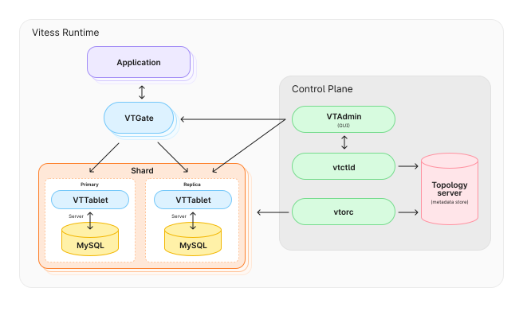
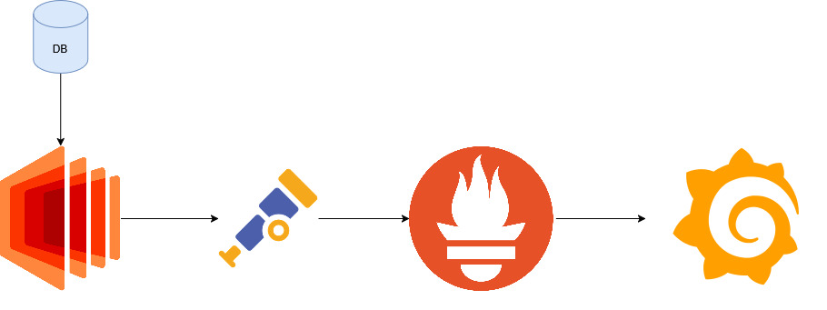
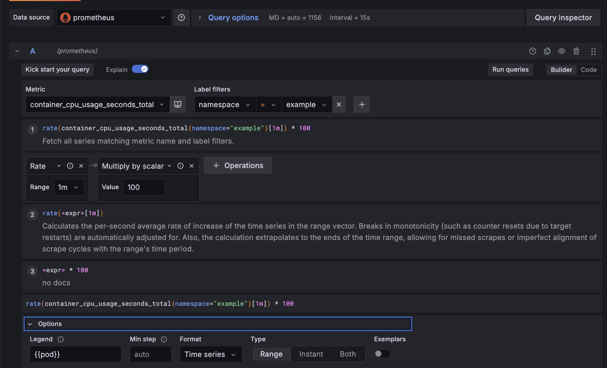
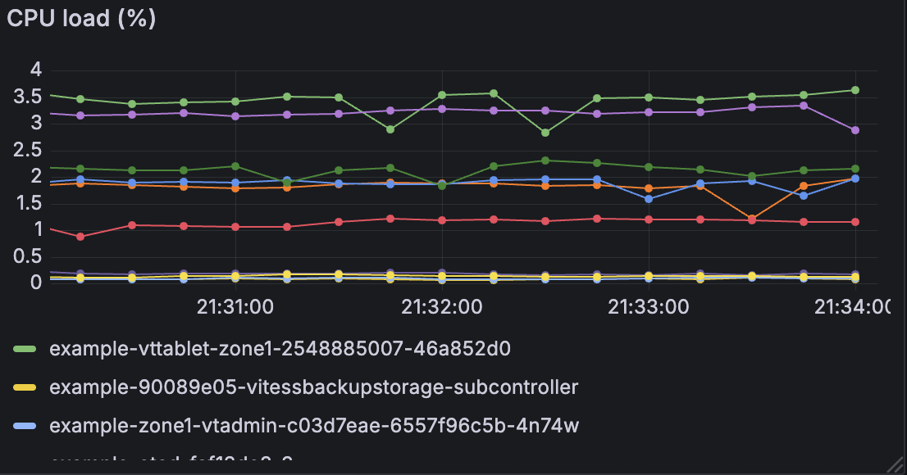
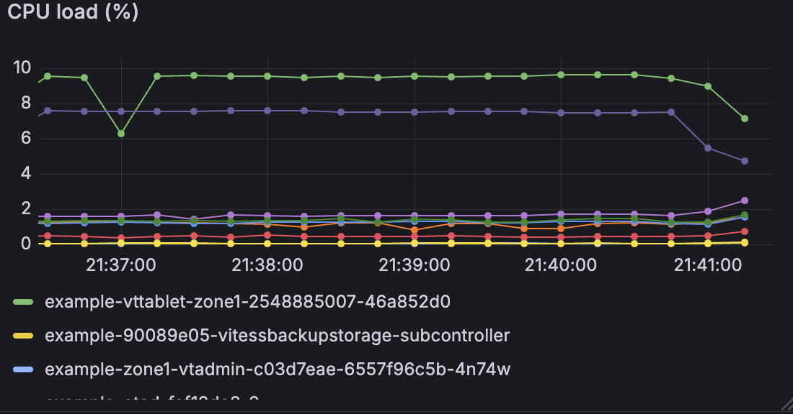

# Vitess Demo

### 1. Wprowadzenie
Celem projektu jest przedstawienie studium przypadku systemu Vitess – open-sourcowej
platformy służącej do skalowania baz danych MySQL w środowiskach chmurowych i rozproszonych. Vitess został stworzony przez YouTube jako odpowiedź na rosnące potrzeby skalowalności i dostępności danych w dużych systemach produkcyjnych, gdzie tradycyjne podejście
do baz danych relacyjnych okazywało się niewystarczające.
Vitess łączy w sobie zalety tradycyjnych baz danych (jak ACID i SQL) z elastycznością architektur opartych na mikrousługach i kontenerach. Umożliwia m.in. sharding, replikację, przełączanie awaryjne oraz zarządzanie schematem w sposób spójny i zautomatyzowany. Dzięki
integracji z Kubernetesem i innymi narzędziami cloud-native, Vitess idealnie wpisuje się w
potrzeby nowoczesnych, skalowalnych aplikacji.

Przykładowe firmy i usługi, które korzystają z technologii Vitess, to:
- YouTube – gdzie projekt się narodził, jako rozwiązanie problemów skalowalności bazy
danych,
- Slack – dla obsługi ogromnej ilości wiadomości i użytkowników w czasie rzeczywistym,
- GitHub – do obsługi skomplikowanej infrastruktury danych przy zachowaniu wysokiej
dostępności i wydajności.

### 2. Wstęp teoretyczny
Vitess składa się z kilku kluczowych komponentów, które współpracują, aby zapewnić wydajność, skalowalność oraz wysoką dostępność baz danych. Oto najważniejsze z nich:

- Vtorc – odpowiada za automatyczne zarządzanie topologią replikacji MySQL oraz wykrywanie i reagowanie na awarie w klastrze bazodanowym.

- VTGate – brama (proxy) łącząca aplikacje z systemem Vitess. Odpowiada za przyjmowanie zapytań SQL od klientów i ich kierowanie do odpowiednich shardów i replik.

- VTTablet – serwis działający obok instancji MySQL w każdej replice. Odpowiada między innymi za zarządzanie instancją MySQL oraz odpowiadanie na zapytania przychodzące z VTGate.

- vtctld – interfejs administracyjny służący do zarządzania klastrem Vitess. Umożliwia między innymi monitorowanie stanu klastra czy tworzenie nowych shardów oraz replik.

- Shardy – instancje baz danych, do których kierowane są zapytania. Każdy z nich posiada własną instancję VTTablet, która jest pośrednikiem w komunikacji między instancją bazy danych a VTGate.

Architektura tej technologii wygląda następująco (obrazek wzięty z oficjalnej dokumentacji Vitess).



### 4 Architektura rozwiązania
W projekcie zaprezentowano uruchomienie klastra Vitess w środowisku Kubernetes przy
użyciu operatora Vitess.
Cała architektura opiera się na kilku warstwach:

- Kubernetes – jako platforma orkiestracyjna do uruchamiania i skalowania usług kontenerowych.

- Vitess Operator – komponent zarządzający zasobami Vitess w klastrze K8s (shardy, replikacje, VTGate, VTTablet, itd.).

- MySQL – backend bazodanowy obsługiwany przez Vitess.

- OTel Collector -  modułowy komponent zbierający, przetwarzający i eksportujący dane telemetryczne (logi, metryki, ślady) zgodnie ze standardem OpenTelemetry

- Prometheus - system monitorowania i alertowania, który zbiera metryki z aplikacji i usług za pomocą modelu pull i przechowuje je w swojej bazie czasowej.

- Grafana – system do wizualizacji metryk.

Architektura została rozbudowana o integrację z narzędziami do obserwowalności (observability), dzięki czemu możliwe było przeanalizowanie rozkładu zapytań i obciążeń w czasie rzeczywistym.


### 5  Konfiguracja środowiska

Środowisko wykonawcze projektu zostało uruchomione lokalnie przy użyciu Minikube — lekkiej wersji klastra Kubernetes przeznaczonej do uruchamiania na pojedynczej maszynie.
W celu zapewnienia odpowiednich zasobów dla komponentów Vitessa, klaster został zainicjowany za pomocą następującej komendy:
```bash
minikube start --cpus=8 --memory=4096 --disk-size=50g
```
Konfiguracja ta przydziela klastrowi 8 wirtualnych CPU, 4 GB pamięci RAM oraz 50 GB przestrzeni dyskowej.

### 6 Metody instalacji
Aby móc korzystać z wyżej opisanego demo, należy wcześniej zainstalować następujące narzędzia:

- kubectl v1.30.2 – narzędzie wiersza poleceń służące do zarządzania klastrami Kubernetes. Umożliwia wykonywanie operacji takich jak wdrażanie aplikacji, monitorowanie zasobów oraz diagnozowanie problemów w środowisku Kubernetes.

- mysql v5.7 – narzędzie wiersza poleceń umożliwiające łączenie się z serwerem MySQL, wykonywanie zapytań SQL oraz zarządzanie bazami danych. Jest przydatne do testowania połączeń, przeglądania danych i administracji bazą.

- vtctldclient – narzędzie wiersza poleceń służące do komunikacji z komponentem vtctld w systemie Vitess. Umożliwia zarządzanie shardami, keyspace’ami i innymi elementami klastra Vitess.

- Docker – platforma do tworzenia, uruchamiania i zarządzania kontenerami. W projekcie wykorzystywana jest do budowania obrazów oraz uruchamiania komponentów systemu Vitess, Otel oraz Grafana w środowisku kontenerowym.

- Minikube – narzędzie umożliwiające lokalne uruchomienie klastra Kubernetes. Używane w tym projekcie jako środowisko testowe dla Vitessa.

### 7. Jak odtworzyć projekt krok po kroku
Sekcja ta ma za zadanie umożliwić innej osobie dokładne odtworzenie środowiska od zera,
w tym instalacji narzędzi i ich konfiguracji. Przedstawia pełny „przepis” krok po kroku.

#### Setup minikube
```bash
minikube start --cpus=8 --memory=4096 --disk-size=50g
```

#### Setup namespace
```bash
kubectl create namespace example
kubectl create namespace telemetry
```

#### Setup Vitess
```bash
cd kube
kubectl apply -f operator.yaml # poczekać aż wstanie
kubectl apply -f 101_initial_cluster.yaml # poczekać aż wstanie
```

#### Seed bazy danych + Port Forwarding
```bash
./pf.sh &
alias mysql="mysql -h 127.0.0.1 -P 15306 -u user"
alias vtctldclient="vtctldclient --server localhost:15999 --alsologtostderr"
vtctldclient ApplySchema --sql="$(cat create_commerce_schema.sql)" commerce
vtctldclient ApplyVSchema --vschema="$(cat vschema_commerce_initial.json)" commerce
```

#### Setup narzędzi do Otel'a
```bash
cd otel
find . -name '*.yaml' -exec kubectl apply -f {} \; # zaaplikowanie kazdego pliku yaml
kubectl port-forward svc/grafana 3000:80 -n telemetry # port forwarding grafany
```

#### Dodanie Prometheusa jako źródło danych
1. Przejdź do zakładki Connections.

2. Wybierz Data Source.

3. Kliknij Add new data source.

4. Z listy dostępnych źródeł wybierz Prometheus.

5. W polu URL wpisz adres: http://prometheus.telemetry.svc.cluster.local:9090

6. Kliknij przycisk Save & test, aby zapisać ustawienia i przetestować połączenie.

#### Przetestowanie dema
```bash
# trzeba byc w ./kube
for i in {1..10000}; do mysql --table < select_commerce_data.sql > /dev/null; done
```

### 8. Otrzymane wyniki
W Grafanie testowaliśmy metrykę o nazwie container_cpu_usage_seconds_total, która służy do mierzenia zużycia CPU przez kontenery. Metryka ta pozwala na dokładną analizę obciążenia CPU generowanego przez poszczególne komponenty systemu uruchomione w kontenerach.

W naszym eksperymencie zebraliśmy dane dla dwóch różnych scenariuszy:

- Bez obciążenia bazy danych – w tym trybie system działał w stanie spoczynku, bez generowania dodatkowego ruchu ani zapytań do bazy danych. Pomiar zużycia CPU w tym scenariuszu pozwala ocenić podstawowe zużycie zasobów przez Vitess oraz powiązane komponenty, co stanowi punkt odniesienia do dalszych analiz.

- Z obciążeniem bazy danych – w tym scenariuszu generowaliśmy ruch i zapytania do bazy danych, aby zasymulować rzeczywiste użytkowanie systemu. Dzięki temu mogliśmy zaobserwować, jak wzrasta zużycie CPU w odpowiedzi na obciążenie oraz ocenić wydajność i skalowalność systemu Vitess pod większym natężeniem pracy.

Poniżej prezentujemy wykresy i dane zebrane z monitoringu, które ilustrują różnice w zużyciu CPU między tymi dwoma stanami, co pozwala na lepsze zrozumienie wpływu obciążenia na zasoby systemowe.






