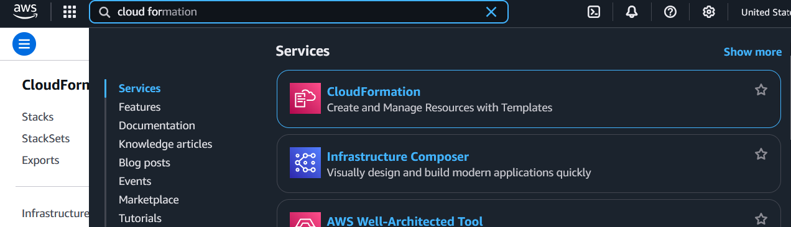
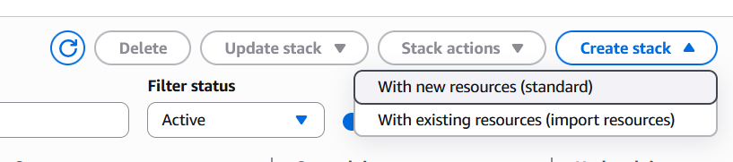
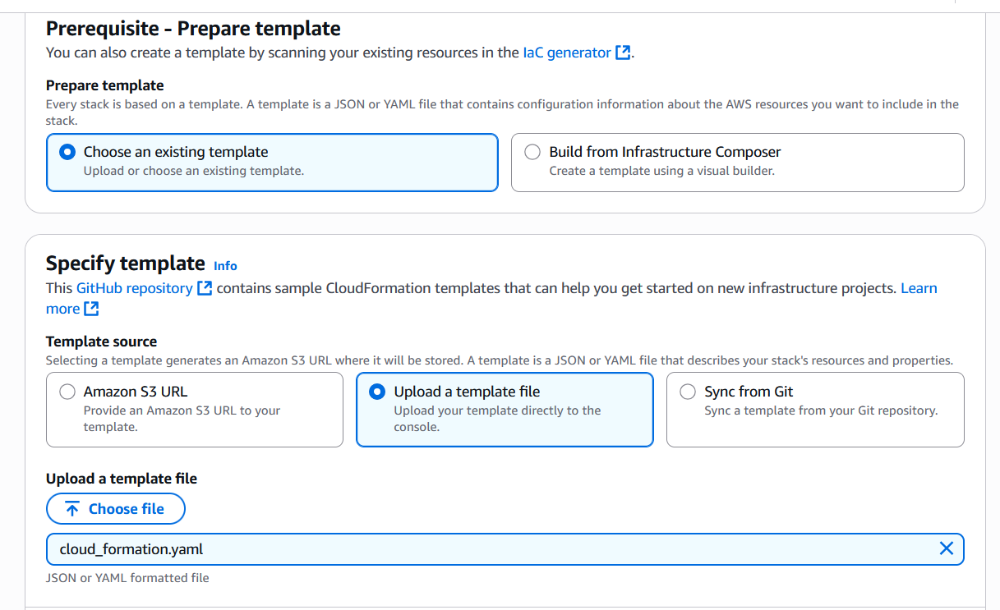
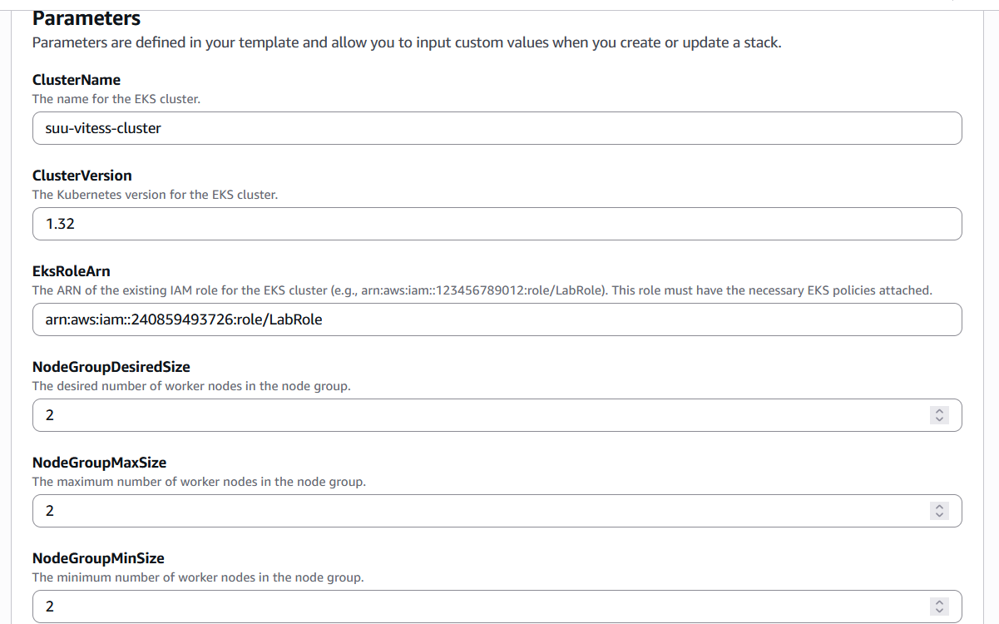
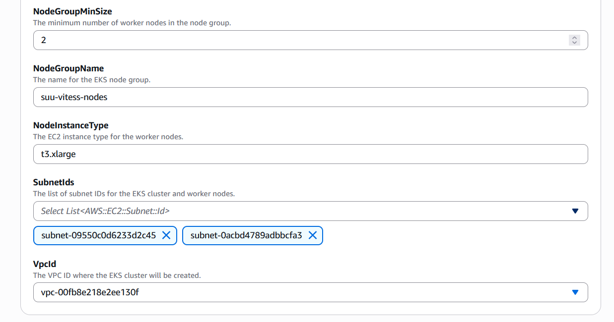

# Demo shardingu w Vitess z OTel

Repozytorium demonstruje, jak skonfigurować środowisko Vitess przy użyciu AWS do zarządzania bazą danych z wykorzystaniem shardingu wertykalnego i horyzontalnego.

---

## 🧱 Wymagania wstępne

Upewnij się, że masz zainstalowane następujące narzędzia:


- [kubectl](https://kubernetes.io/docs/tasks/tools/)
- [mysql](https://dev.mysql.com/doc/mysql-getting-started/en/)
- [`vtctldclient`] installed and available in your PATH

---

# Jak odtworzyć projekt - krok po kroku

Sekcja ta ma za zadanie umożliwić innej osobie dokładne odtworzenie środowiska od zera, w tym instalacji narzędzi i ich konfiguracji. Przedstawia pełny „przepis” krok po kroku.

## Konfiguracja środowiska AWS

- **Krok 1** – Zaloguj się do środowiska AWS oraz przejdź do zakładki AWS Cloud Formation  
  

- **Krok 2** – Utwórz nowy stack przy użyciu nowych zasobów klikając poniższy przycisk  
  

- **Krok 3** – Dodaj plik `cloud_formation.yaml` z folderu `vitess/cloud_formation` jako templatkę opisującą infrastrukturę potrzebną do uruchomienia dema  
  

- **Krok 4** – Skonfiguruj pozostałe pola w następujący sposób  
    
  

- **Krok 5** – Konfiguracja narzędzia kubectl:

```bash
aws eks --region us-east-1 update-kubeconfig --name suu-vitess-cluster
```

## Konfiguracja narzędzia Jaeger
```bash
kubectl apply -f vitess/vitess_config/yaml/jaeger.yaml
```

## Konfiguracja narzędzia Grafana
```bash
kubectl apply -f vitess/vitess_config/yaml/grafana.yaml
```

## Port-forwarding
W nowym terminalu:
```bash
kubectl port-forward service/jaeger-all-in-one 16686:16686 -n observability
```
W nowym terminalu
```bash
kubectl port-forward -n observability service/grafana 3000:3000
```

## Konfiguracja narzędzia Vitess
- **Krok 1** - Utworzenie namespace example
```bash
kubectl create namespace example
```
- **Krok 2** - Utworzenie Operatora
```bash    
kubectl apply -f vitess/vitess_config/yaml/operator.yaml
```
- **Krok 3** - Utworzenie początkowego clustra
```bash
kubectl apply -f vitess/vitess_config/yaml/101_intial_cluster.yaml
```
- **Krok 4** - Uruchomienie skryptu do port-forwardingu (w osobnym terminalu)
```bash
source vitess/vitess_config/pf.sh
```
- **Krok 5**- utworzenie schematu bazy danych i dodanie przykładowych danych
```bash
vtctldclient ApplySchema --sql="$(cat vitess_config/sql/create_commerce_schema.sql)" commerce
vtctldclient ApplyVSchema --vschema="$(cat vitess_config/json/vschema_commerce_initial.json)" commerce    
mysql < vitess_config/sql/insert_commerce_data.sql
```
- **Krok 6** - Dodanie shardingu wertykalnego
```bash
kubectl apply -f vitess_config/yaml/201_customer_tablets.yaml
vtctldclient MoveTables --workflow commerce2customer --target-keyspace customer create --source-keyspace commerce --tables "customer,corder"
vtctldclient vdiff --workflow commerce2customer --target-keyspace customer create
vtctldclient vdiff --workflow commerce2customer --target-keyspace customer show last
vtctldclient MoveTables --workflow commerce2customer --target-keyspace customer switchtraffic --tablet-types "rdonly,replica"
vtctldclient MoveTables --workflow commerce2customer --target-keyspace customer switchtraffic --tablet-types primary
vtctldclient MoveTables --workflow commerce2customer --target-keyspace customer complete
```

- **Krok 7** - Dodanie shardingu horyzontalnego
```bash
vtctldclient ApplySchema --sql="$(cat vitess_config/sql/create_commerce_seq.sql)" commerce
vtctldclient ApplyVSchema --vschema="$(cat vitess_config/json/vschema_commerce_seq.json)" commerce
vtctldclient ApplySchema --sql="$(cat vitess_config/sql/create_customer_sharded.sql)" customer
vtctldclient ApplyVSchema --vschema="$(cat vitess_config/json/vschema_customer_sharded.json)" customer
kubectl apply -f vitess_config/yaml/302_new_shards.yaml

vtctldclient Reshard --workflow cust2cust --target-keyspace customer create --source-shards '-' --target-shards '-80,80-'

vtctldclient vdiff --workflow cust2cust --target-keyspace customer create
vtctldclient vdiff --workflow cust2cust --target-keyspace customer show last

vtctldclient Reshard --workflow cust2cust --target-keyspace customer switchtraffic --tablet-types "rdonly,replica"
vtctldclient Reshard --workflow cust2cust --target-keyspace customer switchtraffic --tablet-types primary

vtctldclient Reshard --workflow cust2cust --target-keyspace customer complete
```

